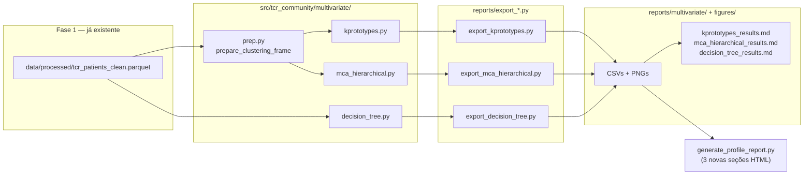
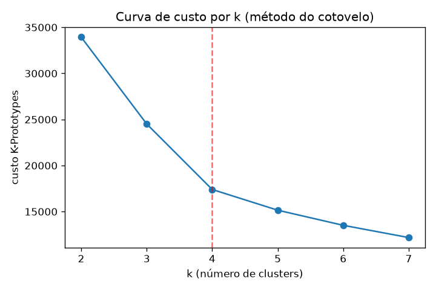
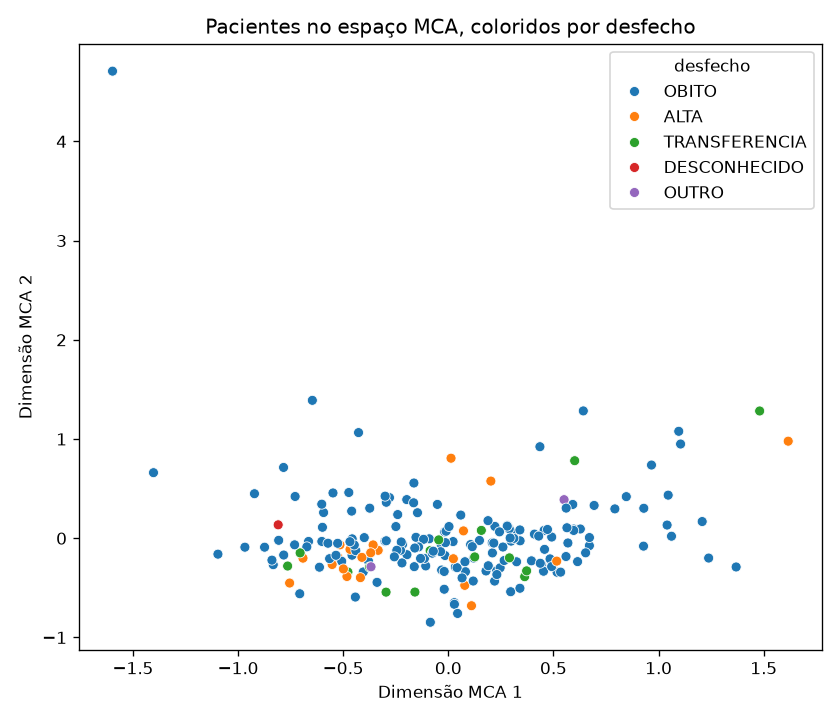
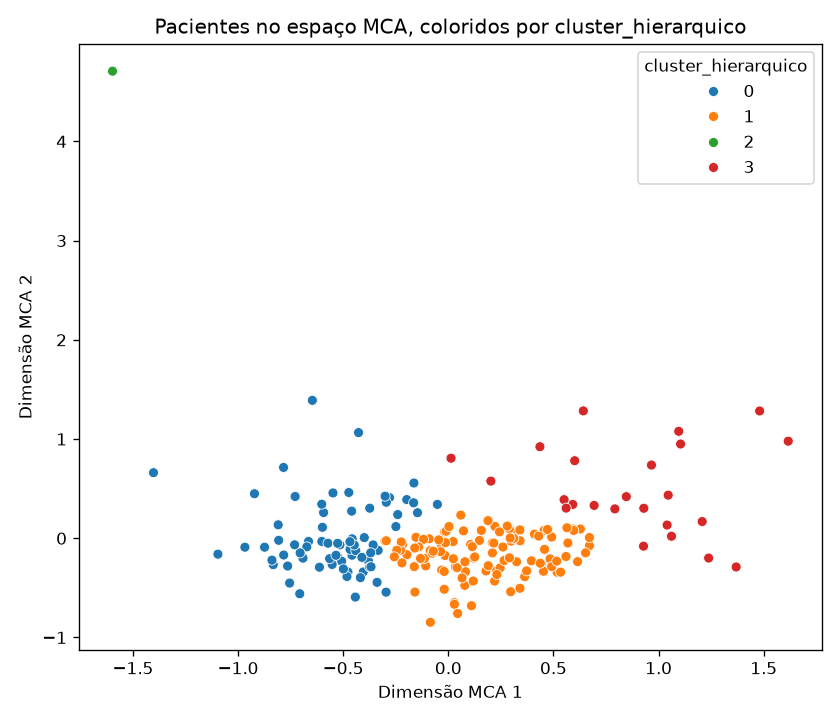
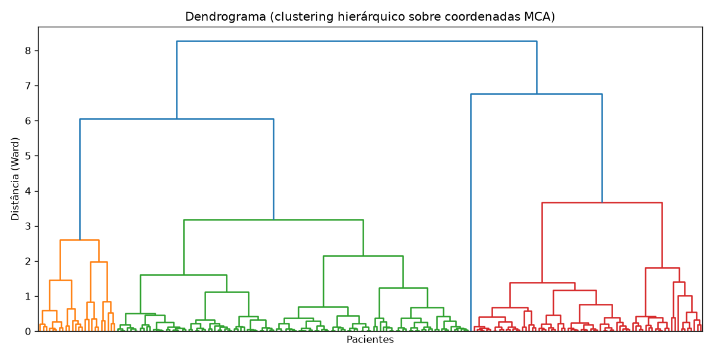
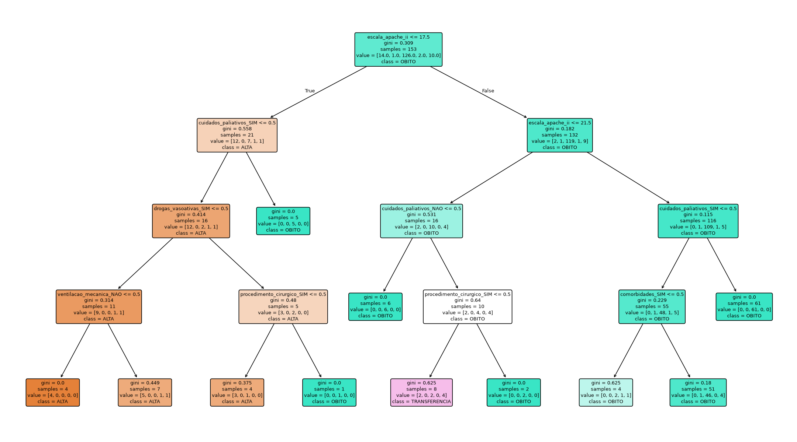

# Estatística Multivariada — Fase 2

## 1. Objetivo

A Fase 1 ([docs/tcr_análise_fase_1_5d3836bc.plan.md](tcr_análise_fase_1_5d3836bc.plan.md))
entregou estatística descritiva e testes de associação bi-variada. A
Fase 2, conforme a proposta comercial
([docs/Proposta de Análise de Dados e Orçamento.pdf](Proposta%20de%20Análise%20de%20Dados%20e%20Orçamento.pdf)),
aplica técnicas de Machine Learning para identificar perfis
sociodemográficos e clínicos ocultos nos 205 pacientes, indo além das
associações variável-a-variável já feitas:

| Entrega | Técnica | Pergunta que responde |
|---|---|---|
| Clusterização mista | K-Prototypes | Que grupos de pacientes emergem ao olhar variáveis categóricas e numéricas juntas? |
| Redução dimensional + clusterização | MCA + hierárquico/k-means | Como os perfis clínicos se distanciam/aproximam visualmente? |
| Modelo explicativo | Árvore de decisão | Quais variáveis mais pesam na previsão do desfecho? |

## 2. O que foi implementado



### 2.1 Correção de bug pré-existente

`src/tcr_community/pipeline/prepare_data.py` tinha `INTERIM_PATH`/
`PROCESSED_PATH` fixos em `/home/rwp/code/tcr_community/...` (sem
`nurse/`), quebrando fora da máquina original. Corrigido para
caminhos relativos ao módulo (`Path(__file__).resolve().parents[3]`) —
nenhum dado mudou de lugar, só a resolução do caminho.

### 2.2 Novo subpacote `src/tcr_community/multivariate/`

Seguindo o mesmo padrão de `stats/` (funções puras, sem I/O):

- **`prep.py`** — `prepare_clustering_frame()` converte os dtypes
  nullable do pandas (`string`, `Int64`) para tipos simples
  (`object`, `float64`) exigidos por `kmodes`/`prince`/`sklearn`, e
  remove linhas com valores ausentes nas variáveis selecionadas.
- **`kprototypes.py`** — `cost_by_k()` (curva de cotovelo),
  `fit_kprototypes()`, `cluster_profile_table()`,
  `cluster_vs_outcome_table()`.
- **`mca_hierarchical.py`** — `fit_mca()` (via `prince.MCA`),
  `hierarchical_linkage_matrix()`, `fit_hierarchical_clusters()`,
  `fit_kmeans_on_mca()`, `mca_scatter_frame()`.
- **`decision_tree.py`** — `prepare_tree_features()`,
  `fit_decision_tree()`, `feature_importance_table()`,
  `tree_text_rules()`.

Testado em `tests/test_multivariate_prep.py`.

### 2.3 Novas dependências

`kmodes` (K-Prototypes), `prince` (MCA), `scikit-learn` (clustering
hierárquico, k-means, árvore de decisão) — `scipy`, já presente,
cobre o dendrograma.

### 2.4 Artefatos gerados

- `reports/multivariate/` — CSVs de cada entrega + os três relatórios
  `.md` em linguagem acessível + `README.md` de inventário.
- `reports/figures/` — 5 novas figuras: curva de cotovelo, 2 scatters
  MCA (por desfecho e por cluster), dendrograma, árvore de decisão.
- `reports/generate_profile_report.py` — três novas seções HTML
  ("Clusters (K-Prototypes)", "MCA e Clustering Hierárquico", "Árvore
  de Decisão"), inseridas entre a análise clínica e as figuras, nos
  dois temas (clássico e minimal).
- `notebooks/modeling/` — três notebooks de demonstração, executados
  ponta a ponta.

## 3. Texto de metodologia (para o artigo)

Continuação do parágrafo de metodologia, cobrindo a Fase 2:

> Os dados coletados foram tabulados e organizados por meio do
> software Microsoft Excel e, sequencialmente, submetidos a duas
> fases de análise estatística. Na fase 1 ocorreu a Análise
> Estatística Descritiva e Inferencial que destinou-se a
> caracterização inicial do perfil epidemiológico e a validação das
> hipóteses de associação bivariada. Na estatística descritiva as
> variáveis categóricas (como gênero e desfecho clínico) foram
> expressas por meio de frequências absolutas e relativas. As
> variáveis quantitativas (como escala de apache II, tempo de
> internação e faixa etária) foram avaliadas por medidas de tendência
> central e dispersão, sendo expressas em média, mediana, valores
> mínimos e máximos e desvio-padrão. Foi realizado testes de
> associação bivariada para verificar existência de associações e
> correlações diretas entre as características clínicas da amostra, e
> o desfecho clínico final, aplicaram-se os testes qui-quadrado de
> Pearson e Teste Exato de Fisher conforme as restrições e adequações
> dos dados.
>
> Durante a fase 2 foi aplicado a Estatística Multivariada e
> Detecção de perfis, que consistiu em uma análise exploratória
> avançada por meio de algoritmos de Machine Learning para
> identificação de padrões complexos e agrupamentos latentes de
> pacientes internados no CTI. Para a clusterização de dados mistos
> (variáveis categóricas e numéricas simultaneamente), utilizou-se o
> algoritmo K-Prototypes, que combina a distância euclidiana para as
> variáveis quantitativas (escala APACHE II e tempo de internação) e
> a dissimilaridade categórica para as variáveis qualitativas
> (comorbidades, ventilação mecânica, drogas vasoativas, transfusão
> sanguínea, hemodiálise, procedimento cirúrgico, cuidados
> paliativos, diagnóstico principal e variáveis sociodemográficas). O
> número de agrupamentos (k) foi definido por meio do método do
> cotovelo (*elbow method*), a partir da análise da curva de custo do
> modelo para valores de k entre 2 e 7, tendo sido selecionado o
> ponto de inflexão da curva como critério de parcimônia entre
> qualidade do agrupamento e interpretabilidade clínica.
>
> Complementarmente, aplicou-se a Análise de Correspondência Múltipla
> (MCA) sobre as variáveis categóricas, técnica de redução de
> dimensionalidade que sintetiza os principais eixos de variação dos
> dados em componentes numéricos (dimensões), permitindo a
> representação gráfica bidimensional da similaridade entre os
> pacientes. Sobre as coordenadas obtidas na MCA, realizou-se
> Clusterização Hierárquica (método de Ward, com matriz de ligação
> calculada por distância euclidiana e representada em dendrograma) e
> Clusterização clássica (algoritmo k-means), ambas parametrizadas
> com o mesmo número de agrupamentos definido para o K-Prototypes, de
> modo a permitir a comparação entre os perfis identificados pelos
> diferentes métodos.
>
> Por fim, para a identificação dos principais preditores clínicos do
> desfecho, construiu-se um modelo de Árvore de Decisão
> (*Classification and Regression Tree* — CART), utilizando o índice de
> impureza de Gini como critério de divisão dos nós. A amostra foi
> particionada em conjuntos de treino (75%) e teste (25%), com
> estratificação pela variável desfecho quando a frequência mínima
> das categorias permitiu; a profundidade máxima da árvore foi
> limitada a 4 níveis, priorizando a interpretabilidade clínica do
> modelo em detrimento de ganhos marginais de acurácia, dado o
> tamanho amostral (n = 205). A importância relativa de cada variável
> preditora foi calculada com base na redução média da impureza
> proporcionada por cada divisão ao longo da árvore. Todas as
> análises foram conduzidas em linguagem Python (versão 3.12),
> utilizando as bibliotecas *kmodes* (K-Prototypes), *prince* (MCA),
> *scikit-learn* (clusterização hierárquica, k-means e árvore de
> decisão) e *scipy* (dendrograma), com nível de significância
> estatística adotado de 5% (p < 0,05) para os testes da fase 1.

**Notas de rastreabilidade** (não fazem parte do texto do artigo,
apenas ligam cada frase à implementação/resultado correspondente):

| Trecho da metodologia | Onde foi implementado/validado |
|---|---|
| K-Prototypes, distância mista | `src/tcr_community/multivariate/kprototypes.py::fit_kprototypes` |
| Elbow method, k entre 2 e 7 | `cost_by_k()`; curva em `reports/figures/cluster_kprototypes_elbow.png` — ponto de inflexão em k=4 (ver §3.1) |
| MCA sobre categóricas | `mca_hierarchical.py::fit_mca` (pacote `prince`) |
| Clusterização hierárquica (Ward) + dendrograma | `hierarchical_linkage_matrix()`/`fit_hierarchical_clusters()`; `reports/figures/mca_dendrogram.png` |
| K-means sobre coordenadas MCA | `fit_kmeans_on_mca()` |
| Árvore de decisão, Gini, treino/teste 75/25 | `decision_tree.py::fit_decision_tree` — resultado real: 153 treino / 52 teste (ver §3.3) |
| Estratificação condicional | fallback implementado porque a categoria DESCONHECIDO do desfecho tem apenas 1 caso na amostra, impedindo estratificação plena |
| max_depth = 4 | escolha documentada como trade-off interpretabilidade × acurácia, não ajuste fino |
| Importância por redução de impureza | `feature_importance_table()` — `DecisionTreeClassifier.feature_importances_` do scikit-learn |

Se o artigo for publicado com números específicos de resultado (k
escolhido, acurácia, preditores), usar os valores reportados na
seção 4 abaixo — eles refletem a execução mais recente sobre a base
de 205 pacientes.

## 4. Resultados

Todas as três técnicas foram aplicadas sobre a base já limpa e
padronizada (`data/processed/tcr_patients_clean.parquet`, n = 205
pacientes, sem exclusões adicionais — nenhuma linha foi descartada por
valor ausente nas variáveis usadas). As subseções abaixo trazem, para
cada técnica: uma explicação breve do método, os parâmetros usados, os
números obtidos e as figuras correspondentes.

### 4.1 Clusterização K-Prototypes

**O que é e por que foi usada.** K-Prototypes é uma variante do
algoritmo k-means capaz de agrupar pacientes considerando
simultaneamente variáveis numéricas (distância euclidiana) e
categóricas (dissimilaridade por correspondência exata), combinadas
em uma única função de custo. Isso evita a necessidade de descartar
ou transformar artificialmente variáveis categóricas, como seria
preciso com k-means tradicional.

**Variáveis usadas:** comorbidades, ventilação mecânica, drogas
vasoativas, transfusão sanguínea, hemodiálise, procedimento
cirúrgico, cuidados paliativos, diagnóstico principal, gênero, faixa
etária e local de residência (categóricas) + escala APACHE II e tempo
de internação na UTI (numéricas).

**Escolha do número de clusters (k).** Testou-se k de 2 a 7,
registrando o custo do modelo (soma das dissimilaridades
intra-cluster) para cada valor:

| k | Custo |
|---|---|
| 2 | 33.939,6 |
| 3 | 24.514,1 |
| **4** | **17.402,3** |
| 5 | 15.154,0 |
| 6 | 13.513,9 |
| 7 | 12.183,8 |

A curva mostra queda acentuada até k=4 e ganhos marginais e
decrescentes a partir daí (o "cotovelo" da curva) — critério clássico
do método do cotovelo para balancear qualidade de agrupamento e
parcimônia/interpretabilidade. Adotou-se **k=4**.



*Figura 1. Curva de custo do algoritmo K-Prototypes para k de 2 a 7. A
linha tracejada vermelha marca o k escolhido (k=4), no ponto de
inflexão da curva.*

**Perfis identificados.** Cada cluster foi caracterizado pela moda
(variáveis categóricas) e pela média (variáveis numéricas) dos seus
integrantes:

| Cluster | n | Diagnóstico predominante | Perfil clínico dominante | APACHE II médio | Tempo de UTI médio (dias) | % óbito |
|---|---|---|---|---|---|---|
| 0 | 10 | AVC isquêmico | Homens, ~32 anos, ventilação mecânica, drogas vasoativas, transfusão sanguínea e procedimento cirúrgico | 32,6 | **55,2** | 90,0% |
| 1 | 77 | Septicemia | Mulheres, ~80 anos, ventilação mecânica e drogas vasoativas | **35,5** | 5,6 | 94,8% |
| 2 | 48 | Pneumonia não especificada | Homens, ~76 anos, em cuidados paliativos | 28,4 | 23,9 | 93,8% |
| 3 | 70 | DPOC exacerbado | Homens, ~83 anos | **19,5** (mais baixo) | 6,1 | **55,7%** (mais baixo) |

O **cluster 0** reúne o subgrupo mais jovem da amostra (AVC
isquêmico, ~32 anos), com o maior tempo de internação em UTI (55,2
dias em média) e alta carga de suporte (ventilação mecânica, drogas
vasoativas, transfusão e cirurgia), refletindo um perfil de paciente
agudo grave com desfecho predominantemente desfavorável (90,0% de
óbito apesar da menor idade). O **cluster 1**, o mais numeroso (n=77),
concentra pacientes idosos (~80 anos) com septicemia, o maior escore
APACHE II médio (35,5) e a maior taxa de óbito observada entre os
quatro grupos (94,8%). O **cluster 2** reúne pacientes com pneumonia,
igualmente idosos, com forte presença de cuidados paliativos e
mortalidade também elevada (93,8%). O **cluster 3** se distingue dos
demais por reunir pacientes com DPOC exacerbado e o menor escore
APACHE II médio da amostra (19,5), acompanhado da menor taxa de óbito
(55,7%) — um achado coerente com a gravidade inicial mais baixa desse
grupo, mas descritivo, não causal.

| Cluster | % Alta | % Óbito | % Transferência | % Outro/Desconhecido |
|---|---|---|---|---|
| 0 | 10,0% | 90,0% | 0,0% | 0,0% |
| 1 | 1,3% | 94,8% | 2,6% | 1,3% |
| 2 | 2,1% | 93,8% | 4,2% | 0,0% |
| 3 | 25,7% | 55,7% | 15,7% | 1,4% |

*Tabela 2. Cruzamento cluster × desfecho clínico (percentual por
linha).*

Guia completo em linguagem acessível:
[reports/multivariate/kprototypes_results.md](../reports/multivariate/kprototypes_results.md).

### 4.2 Análise de Correspondência Múltipla (MCA) + clustering hierárquico e k-means

**O que é e por que foi usada.** MCA é uma técnica de redução de
dimensionalidade para dados categóricos: resume dezenas de variáveis
categóricas em poucos eixos numéricos (dimensões) que capturam os
principais padrões de variação e co-ocorrência entre categorias,
permitindo representar cada paciente como um ponto em um espaço 2D e
visualizar semelhanças/diferenças de forma direta. Sobre essas
coordenadas, aplicou-se **clusterização hierárquica** (método de
Ward, distância euclidiana, representada em dendrograma) e **k-means
clássico**, ambos com o mesmo número de grupos (4) usado no
K-Prototypes, para permitir comparação entre os métodos.

**Variância explicada.** Como há muitas variáveis categóricas com
muitas categorias (ex.: dezenas de diagnósticos distintos), a
variância se distribui por muitas dimensões — cada uma explica uma
fração pequena da variação total:

| Dimensão | % de variância |
|---|---|
| 1 | 1,82% |
| 2 | 1,55% |
| 3 | 1,44% |
| 4 | 1,38% |
| 5 | 1,35% |

Isso é esperado e não indica problema nos dados — é uma característica
conhecida da MCA quando aplicada a muitas variáveis categóricas com
muitas categorias. As duas primeiras dimensões (as de maior variância)
foram usadas para a visualização 2D e a clusterização subsequente.



*Figura 2. Projeção dos 205 pacientes nas duas primeiras dimensões da
MCA, coloridos pelo desfecho clínico. Proximidade entre pontos indica
perfil categórico semelhante; os eixos não têm unidade clínica
direta.*



*Figura 3. Mesma projeção da Figura 2, colorida pelos 4 clusters
obtidos por clusterização hierárquica (Ward) sobre as coordenadas
MCA.*



*Figura 4. Dendrograma da clusterização hierárquica (Ward) sobre as
duas primeiras dimensões MCA. A altura de cada nó indica a distância
(dissimilaridade) entre os grupos unidos; o corte em 4 ramos
principais define os clusters reportados.*

Os agrupamentos obtidos por MCA + hierárquico apresentam sobreposição
parcial com os clusters do K-Prototypes (ambos derivam das mesmas
variáveis clínicas de base, por caminhos matemáticos distintos), o
que reforça a plausibilidade da estrutura de 4 perfis identificada —
sem, no entanto, produzir uma correspondência exata entre os rótulos
de cluster dos dois métodos. Guia completo:
[reports/multivariate/mca_hierarchical_results.md](../reports/multivariate/mca_hierarchical_results.md).

### 4.3 Árvore de decisão (CART)

**O que é e por que foi usada.** A árvore de decisão é um modelo de
classificação que particiona os pacientes por meio de uma sequência
de perguntas binárias (ex.: "APACHE II ≤ 17,5?"), escolhidas em cada
nó para maximizar a separação entre categorias de desfecho (critério
de impureza de Gini). Diferentemente dos algoritmos de clusterização
anteriores (não supervisionados), a árvore é um modelo supervisionado:
usa o desfecho clínico conhecido como alvo, o que permite tanto prever
o desfecho de novos pacientes quanto quantificar a importância
relativa de cada variável preditora.

**Configuração.** Preditoras: comorbidades, ventilação mecânica,
drogas vasoativas, transfusão sanguínea, hemodiálise, procedimento
cirúrgico, cuidados paliativos e escala APACHE II (as mesmas 8
variáveis já testadas na Fase 1). Alvo: desfecho clínico padronizado
(5 categorias: ÓBITO, ALTA, TRANSFERÊNCIA, OUTRO, DESCONHECIDO).
Profundidade máxima limitada a 4 níveis, para manter o modelo
interpretável por um público não técnico, sem ajuste fino adicional
dado o tamanho amostral. Divisão treino/teste: 75%/25% (153 pacientes
de treino, 52 de teste), com estratificação pela variável alvo.

**Desempenho do modelo.**

| Métrica | Valor |
|---|---|
| Acurácia no treino | 90,8% |
| Acurácia no teste (holdout) | **80,8%** |
| n treino / n teste | 153 / 52 |
| Profundidade máxima | 4 |

A diferença entre acurácia de treino e teste (90,8% vs. 80,8%) é
esperada e moderada, sem indício de sobreajuste severo — mas os 205
pacientes disponíveis (52 no conjunto de teste) tornam essa estimativa
preliminar, sujeita a variação caso a amostra seja ampliada.

**Desempenho por categoria de desfecho** (conjunto de teste, n=52):

| Categoria | Precisão | Sensibilidade (recall) | F1-score | n no teste |
|---|---|---|---|---|
| ÓBITO | 0,88 | 0,95 | 0,92 | 40 |
| ALTA | 0,40 | 0,29 | 0,33 | 7 |
| TRANSFERÊNCIA | 0,50 | 0,40 | 0,44 | 5 |
| **Acurácia geral** | | | **0,81** | 52 |
| Média macro (não ponderada) | 0,59 | 0,55 | 0,56 | 52 |

*Tabela 3. Métricas de classificação por categoria no conjunto de
teste. A categoria ÓBITO concentra 40 dos 52 casos de teste
(76,9%), explicando por que a acurácia geral (81%) é bem superior ao
desempenho médio entre categorias (F1 macro = 0,56).*

A tabela evidencia o efeito do desbalanceamento de classes na base
completa (166 óbitos em 205 pacientes, 81,0%): o modelo prevê a
categoria ÓBITO com boa precisão e sensibilidade (0,88 e 0,95), mas o
desempenho cai substancialmente para ALTA e TRANSFERÊNCIA — categorias
com poucos casos disponíveis tanto para treino quanto para avaliação.
Previsões do modelo para pacientes fora do perfil de óbito devem ser
interpretadas com cautela.

**Importância das variáveis preditoras** (proporção da redução total
de impureza atribuída a cada variável ao longo da árvore):

| Preditor | Importância |
|---|---|
| Escala APACHE II | **52,8%** |
| Cuidados paliativos = SIM | 22,4% |
| Procedimento cirúrgico = SIM | 8,9% |
| Cuidados paliativos = NÃO | 8,1% |
| Comorbidades = SIM | 3,6% |
| Drogas vasoativas = SIM | 3,0% |
| Ventilação mecânica = NÃO | 1,2% |
| Demais variáveis (transfusão, hemodiálise, outras categorias) | 0,0% |

A escala APACHE II, isoladamente, respondeu por mais da metade da
capacidade discriminativa do modelo — resultado consistente com o
achado da Fase 1, em que o APACHE II já havia se mostrado a variável
mais fortemente associada ao desfecho (teste de Kruskal-Wallis,
p ≈ 1,48×10⁻⁹). Cuidados paliativos, segunda variável mais
importante, também replicou associação significativa já identificada
na Fase 1 (χ², p ≈ 7,47×10⁻⁶).



*Figura 5. Árvore de decisão completa (profundidade máxima 4). Cada
nó mostra a pergunta de divisão, o índice de Gini, o número de
pacientes de treino que passaram por ele (`samples`), a distribuição
de desfechos (`value`, na ordem [ALTA, DESCONHECIDO, ÓBITO, OUTRO,
TRANSFERÊNCIA]) e a classe majoritária (`class`).*

A regra de topo da árvore — `escala_apache_ii ≤ 17,5` — já separa de
forma relevante pacientes de menor e maior risco: entre os 153
pacientes de treino, os 21 com APACHE II ≤ 17,5 e sem cuidados
paliativos concentraram a maioria dos casos de ALTA, enquanto o ramo
com APACHE II > 21,5 é dominado quase inteiramente por ÓBITO,
independentemente das demais variáveis.

Guia completo, incluindo as regras integrais da árvore em texto:
[reports/multivariate/decision_tree_results.md](../reports/multivariate/decision_tree_results.md)
e [reports/multivariate/tree_rules.txt](../reports/multivariate/tree_rules.txt).

## 5. Como reproduzir

```bash
uv run python reports/export_kprototypes.py
uv run python reports/export_mca_hierarchical.py
uv run python reports/export_decision_tree.py
uv run python reports/generate_profile_report.py   # regenera tudo + HTML
uv run pytest
```

Relatórios finais: `reports/profile_report.html` (clássico) e
`reports/profile_report_minimal.html` (Apple-inspired, com seções
navegáveis via TOC).

## 6. Próximos passos (fora do escopo desta fase)

- Suporte contínuo durante redação dos resultados (gráficos/cruzamentos
  adicionais sob demanda), conforme previsto na proposta comercial.
- Se a amostra crescer, revisar o desbalanceamento de classes da
  árvore de decisão e considerar técnicas de balanceamento.
