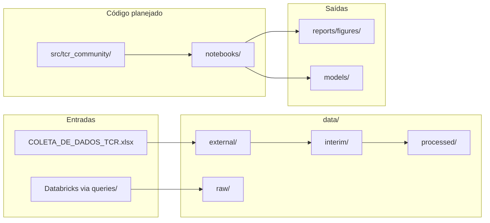
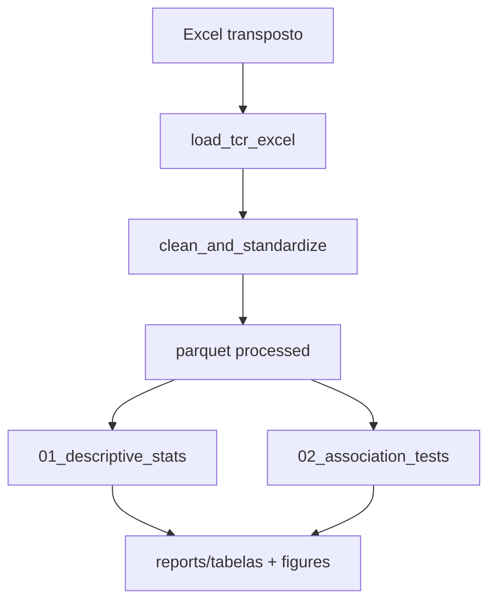

# Estrutura do Projeto e Plano — Fase 1

## 1. Estrutura atual do repositório

O repositório é um **template de ciência de dados** recém-inicializado ([CHANGELOG.md](CHANGELOG.md)). Ainda **não há código de análise** — apenas estrutura de pastas, config e documentação.



| Área | Estado atual |
|------|--------------|
| [`src/tcr_community/`](src/) | **Não existe** — só `src/__init__.py` vazio (README desatualizado) |
| [`tests/`](tests/) | **Não existe** |
| [`notebooks/`](notebooks/) | Subpastas vazias (`eda/`, `processing/`, etc.) |
| [`data/external/`](data/external/) | `COLETA_DE_DADOS_TCR.xlsx` presente localmente (git-ignored) |
| [`data/raw/`, `interim/`, `processed/`](data/) | Vazios |
| Dependências | Só `ruff` em dev — **sem pandas, scipy, sklearn** |
| Databricks | Template em [`config/.env.example`](config/.env.example) — não usado ainda |

**Convenções do projeto** ([AGENT.md](AGENT.md)): Python 3.12+, type hints, ruff (79 chars), registry/base classes (ainda não implementados), commits Conventional Commits.

---

## 2. O que temos que fazer (docs + dados)

Fonte principal: [`docs/data_analisis.md`](docs/data_analisis.md) (espelha a proposta em PDF).

### Escopo analítico completo (referência)

| Fase | Entregas | Variáveis-chave |
|------|----------|-----------------|
| **Fase 1** (prioridade) | Descritiva demográfica e clínica; testes de associação (χ² / Fisher) | Demográficas (1–7); clínicas (8–24); desfecho (24) vs comorbidades, ventilação, etc. |
| **Fase 2** (depois) | K-Prototypes, MCA + cluster hierárquico, árvore de decisão | APACHE II + variáveis categóricas mistas; alvo = desfecho |

### Dados reais no Excel

Arquivo: [`data/external/COLETA_DE_DADOS_TCR.xlsx`](data/external/COLETA_DE_DADOS_TCR.xlsx)

- **Formato transposto**: linhas = variáveis, colunas = pacientes (~205)
- **Variáveis identificadas** (após transposição):

| # | Variável | Tipo | Observações de qualidade |
|---|----------|------|--------------------------|
| — | `n° do atendimento` | ID | Chave natural |
| 1–3 | Gênero, Faixa etária, Local residência | Cat / num | Espaços (`"F "`), gênero com valor `3` |
| 4 | Escala APACHE II | Numérica | 37 valores distintos |
| 5–14 | Dispositivo invasivo, VM, sedação, drogas, transfusão, hemodiálise, cirurgia, procedência, diagnóstico, comorbidades, vícios, paliativos, PCR | Categórica (texto livre composto) | `NAO`/`NÃO`/`NAO `; campos concatenados (`HAS_DM2_ICC_...`) |
| 15–18 | Datas admissão/alta, causa óbito, tempo UTI | Data / num / cat | Datas mistas (datetime + string `13/08/2024.`) |
| 19 | **Desfecho clínico** | Categórica | `OBITO`, `ALTA`, `TRANSFERENCIA_*`, etc. — precisa padronização |
| 20–21 | UTI, Feridas (LPP) | Num / cat | — |

**Gap vs. proposta**: a ficha original previa 24 variáveis numeradas; o Excel tem ~21 campos úteis + metadados. Campos como "ocupação" da proposta não aparecem no arquivo — validar com stakeholders se faltam dados ou se a numeração da proposta é de outra versão da ficha.

### Desafios de dados (pré-requisito para Fase 1)

1. **Transposição** Excel → tabela paciente × variável
2. **Padronização** de respostas binárias (`SIM`/`NAO`/`NÃO`/espaços)
3. **Desfecho clínico** — definir categorias para análise (ex.: óbito vs alta vs transferência)
4. **Campos compostos** — para Fase 1, tratar como categóricos brutos ou derivar flags (`ventilacao_mecanica_sim`); parsing completo pode ser incremental
5. **Datas** — unificar formato para calcular tempo de internação (ou usar coluna já existente)

---

## 3. Plano de implementação — Fase 1

Prioridade confirmada: **Fase 1 primeiro**.

### Etapa A — Fundação do projeto

- Criar pacote [`src/tcr_community/`](src/tcr_community/) com módulos mínimos:
  - `io/loaders.py` — leitura do Excel transposto
  - `cleaning/standardize.py` — normalização de strings, desfecho, datas
  - `schemas/columns.py` — constantes de nomes de colunas e tipos
- Adicionar dependências em [`pyproject.toml`](pyproject.toml):
  - Runtime: `pandas`, `openpyxl`, `scipy`, `numpy`
  - Dev: `pytest`
- Salvar artefatos:
  - `data/interim/tcr_patients_raw.parquet` (transposto, mínima limpeza)
  - `data/processed/tcr_patients_clean.parquet` (pronto para análise)

### Etapa B — Estatística descritiva

Notebook [`notebooks/eda/01_descriptive_stats.ipynb`](notebooks/eda/01_descriptive_stats.ipynb):

- **Demográfica** (gênero, faixa etária, local): tabelas de frequência absoluta/relativa
- **Clínica** (APACHE II, tempo UTI, desfecho, dispositivos, etc.):
  - Categóricas → frequências
  - Quantitativas → média, mediana, min/max, desvio padrão
- Exportar tabelas para `reports/` (CSV ou HTML) e figuras para `reports/figures/`

Funções reutilizáveis em `src/tcr_community/stats/descriptive.py`.

### Etapa C — Testes de associação bi-variados

Notebook [`notebooks/eda/02_association_tests.ipynb`](notebooks/eda/02_association_tests.ipynb):

- **Alvo principal**: desfecho clínico (padronizado)
- **Preditoras**: comorbidades (flag SIM/NAO ou categoria simplificada), ventilação mecânica, drogas vasoativas, transfusão, APACHE II (categorizado ou como variável contínua em testes apropriados)
- Testes:
  - Categórica × categórica → χ² de Pearson; Fisher se células < 5
  - Contínua × categórica → Mann-Whitney ou t-test conforme normalidade
- Funções em `src/tcr_community/stats/association.py` com docstrings e type hints

### Etapa D — Testes e documentação mínima

- `tests/test_loaders.py` — shape esperado, colunas, transposição
- `tests/test_standardize.py` — normalização NAO/NÃO, desfecho
- Atualizar descrição em README (contexto TCR/UTI) — opcional, se solicitado

---

## 4. Fluxo de execução previsto



Comandos após implementação:

```bash
uv run python -m tcr_community.pipeline.prepare_data   # ou notebook get_data
uv run pytest tests/
uv run ruff check src/ tests/
```

---

## 5. Fora do escopo imediato (Fase 2 — depois)

- K-Prototypes (`kmodes` ou implementação custom)
- MCA + dendrogramas (`prince` ou `sklearn` + `scipy.cluster`)
- Árvore de decisão (`sklearn.tree`)
- Parsing avançado de comorbidades/dispositivos em múltiplas flags
- Integração Databricks

---

## 6. Decisão pendente (pequena)

Antes dos testes de associação, confirmar com o time como **padronizar desfecho clínico**:

- **Opção A**: 3 categorias — Óbito / Alta / Transferência
- **Opção B**: Binário — Óbito vs Sobrevivência (alta + transferência)
- **Opção C**: Manter todas as categorias originais (17 valores distintos — pouco poder estatístico)

Recomendação: **Opção A** para Fase 1, com nota na discussão sobre transferências.
